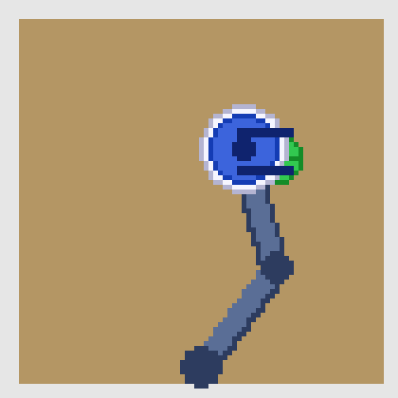
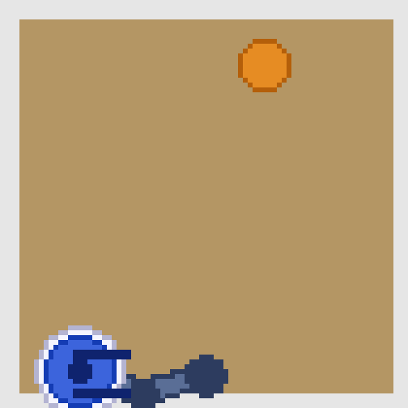
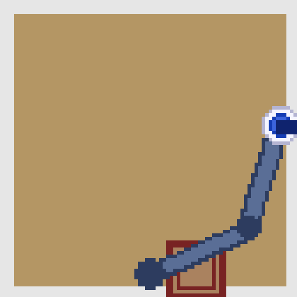
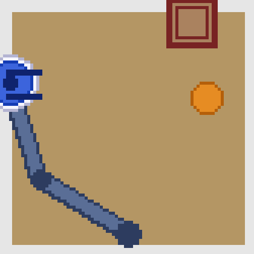

# vla-from-scratch

Build, train, and evaluate a Vision-Language-Action policy on a single consumer GPU.

## Project Goal

The goal of vla-from-scratch is to provide a practical, reproducible VLA training pipeline that helps learners and builders go from raw simulated demonstrations to a deployable policy with measurable results.

This repository focuses on:
- Clear stage-by-stage training code
- Reproducible local experiments
- Publishable metrics and artifacts

## What You Get

- Modular VLA model stack (vision encoder, language encoder, fusion, action head)
- Stage B supervised behavior cloning trainer
- Stage C DAgger-lite post-training loop
- Stage D evaluation harness with JSON metrics, HTML report, and demo GIFs
- One-command runner for quick local execution

## Quick Start

### 1) Create environment

```bash
conda env create -f environment.yml -n vla
conda activate vla
```

### 2) Run the pipeline

```bash
chmod +x quick_start.sh
./quick_start.sh all
```

Run a single stage:

```bash
./quick_start.sh sft
./quick_start.sh posttrain
./quick_start.sh eval
```

## Final Results

Latest evaluation artifacts are in outputs/eval.

From outputs/eval/metrics.json:

| Checkpoint | Overall Success | Reach | Pick | Place | Pick+Place |
|---|---:|---:|---:|---:|---:|
| SFT (outputs/sft/best.pt) | 58.6% | 100.0% | 50.0% | 50.0% | 34.4% |
| DAgger-lite (outputs/posttrain/best.pt) | 25.8% | 40.6% | 53.1% | 6.3% | 3.1% |
| Best-per-task ensemble | 63.3% | 100.0% | 68.8% | 59.4% | 25.0% |

Generated outputs:
- JSON metrics: outputs/eval/metrics.json
- HTML report: outputs/eval/report.html
- Demo GIFs (repo): media/

### Qualitative Demos (Best-Per-Task)

| reach_target | pick_object |
|---|---|
|  |  |

| place_object | pick_and_place_object |
|---|---|
|  |  |

## Repository Layout

```text
vla-from-scratch/
├── quick_start.sh
├── environment.yml
├── configs/
├── data/
├── docs/
├── src/
│   ├── models/
│   ├── train/
│   ├── posttrain/
│   └── eval/
└── outputs/   
```

## Training Pipeline

- Stage B: Supervised Fine-Tuning (behavior cloning)
- Stage C: Post-training (DAgger-lite)
- Stage D: Evaluation and reporting

## Citations

If this project helps your work, cite foundational references:

- RT-2: https://robotics-transformer2.github.io/
- OpenVLA: https://openvla.github.io/
- ManiSkill: https://maniskill.readthedocs.io/
- Attention Is All You Need: https://arxiv.org/abs/1706.03762
- An Image is Worth 16x16 Words: https://arxiv.org/abs/2010.11929

## Acknowledgements

Thanks to the open robotics and open-source ML communities for public simulators, model design references, and tooling that make local VLA research feasible.

## Notes on Data and Artifacts

- Large model files, raw data, logs, and generated artifacts are excluded from git.
- Use outputs/eval for local reports and media exports.

## License

This project is licensed under the MIT License. See [LICENSE](LICENSE).
